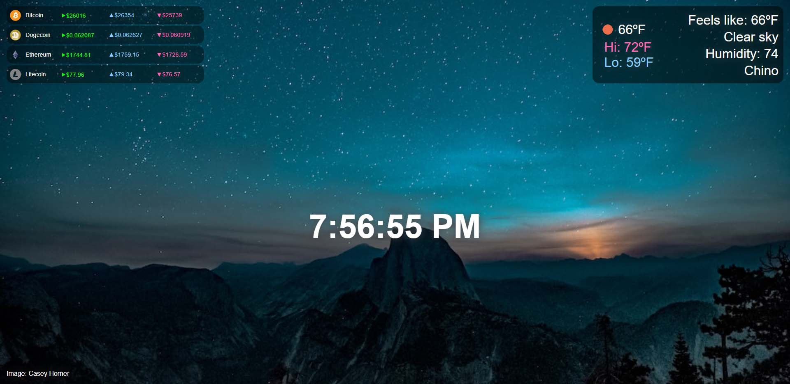
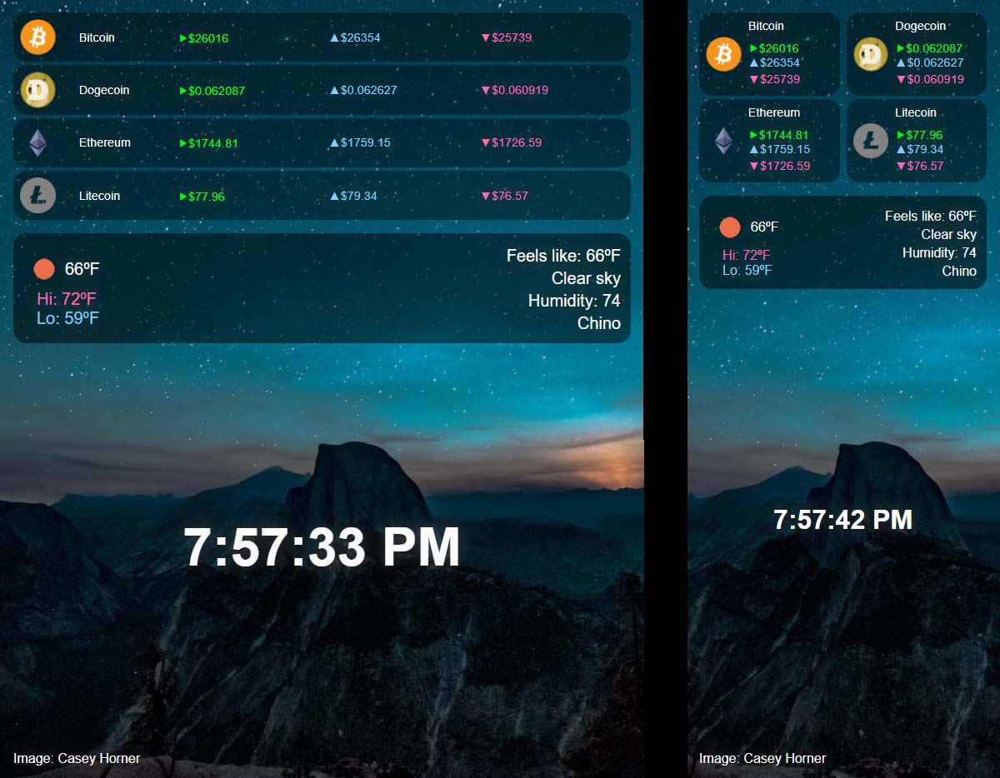

# Dashboard

This is the 4th project in Module 9 (Working with APIs) of Scrimba's [Frontend Developer Path](https://scrimba.com/learn/frontend). This unit focused on handling __promise rejections__ from an API by building a dashboard that communicates with the [CoinGecko API](https://www.coingecko.com/en/api) for crypto currency data, the [Unsplash API](https://unsplash.com/developers) for background images and the [Open Weather API](https://openweathermap.org/api) for weather information, as well as using the local comuter for __time__ and __location__ information.

The course uses the `fetch` API along with `.then` and `.catch` methods to write asynchronous JavaScript to get data from external APIs and handle any errors. I took a different approach and upgraded from `.then` and `.catch` to using `async` and `await` to write asynchronous functions.

My version is responsive, as well, leaning into __CSS Grid__ for much of it's layout and __CSS Flexbox__ for simpler layout needs. It additionally includes a `manifest.json` file so that it can be imported into Chrome as a Chrome extension.

Deployed at: https://vish213-crypto-weather-dashboard.netlify.app/

## JavaScript concepts

- variables
- functions
- asynchronous functions
    - async
    - await
    - Promise.all
    - try/catch
- fetch()
- if/else statements
- arrays
    - .forEach()
    - .map()
    - .push()
- string template literals
- Date
    - .toLocaleTimeString()
- navigator
    - .geolocation
        - .getCurrentPosition()
- throw
    - Error
- console.error
- document
    - .style
        - .backgroundImage
    - .getElementById()
        - .innerHTML
        - .textContent
- Math
    - .round()